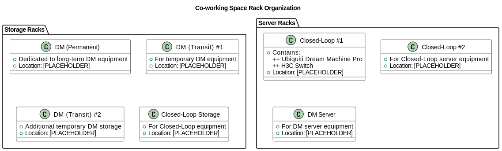

# DM North Standard Operating Procedure
## Version 1.0

## Introduction

This Standard Operating Procedure (SOP) outlines the organizational structure and management guidelines for storage and server equipment within our shared co-working environment. As Digital Missions (DM) operates within the Closed-Loop industrial automation facility, proper organization of equipment is essential to maintain operational efficiency, ensure clarity of ownership, and facilitate easy access to resources.

The purpose of this document is to establish a standardized approach to the organization of storage racks and server infrastructure, clearly delineating between permanent and transitional DM assets and Closed-Loop equipment. This SOP will serve as a reference guide for all team members to understand the designated locations of hardware and the rationale behind the organizational structure.

## Equipment Organization Overview

Our co-working space contains the following major organizational elements:

### Storage Racks
- DM (Permanent): Reserved for long-term Digital Missions equipment
- DM (Transit) #1: For temporary Digital Missions equipment in transition
- DM (Transit) #2: Additional space for temporary Digital Missions equipment
- Closed-Loop: Storage dedicated to Closed-Loop equipment

### Server Racks
- Closed-Loop #1: Contains Ubiquiti Dream Machine Pro and H3C switch
- Closed-Loop #2: Reserved for Closed-Loop server equipment
- DM: Dedicated to Digital Missions server equipment

## Rack Layout Diagram

Below is a visual representation of the rack organization:

## Responsibilities and Maintenance

| Name            | Telegram Contact     | Role                      | Responsibility                                               |
|-----------------|----------------------|---------------------------|-------------------------------------------------------------|
| Gordon Chia     | @mingxxv             | DM North Hardware Engineer | Responsible for the upkeep of hardware and systems in DM North |
| Sherwin See     | @Sherwinseezhiyong   | DM North Onsite Custodian | Responsible for onsite assistance and management            |
| HongZhuang Lim  | NIL                  | DM360 POC                 | Point of Contact and escalation of DM North matters         |

## Equipment Labeling Standards

| Hardware Category | Item Type | Labeling Format | Notes |
|-------------------|-----------|-----------------|-------|
| DM North Permanent Hardware | Desktops/Laptops | PC-xxx | Unique serial number for each device |
| DM North Permanent Hardware | Mobile Devices | MD-xxx | Unique serial number for each device |
| DM North Permanent Hardware | Monitors | MO-xxx | Unique serial number for each device |
| DM North Permanent Hardware | Keyboards/Mice | — | To be tagged to the PC it's attached to |
| DM North Transit Hardware | All Items | — | No serial numbers, custodian to ensure secure storage of these hardware |
| Closed-Loop Hardware | All Items | — | Existing inventory system, custodian to ensure secure storage of these hardware |

## Modification Procedures

If any modifications are requested, please reach out to either Gordon or Sherwin with a request for change. In your request, please state:

* Name of Request
* Description of Request
* Rationale for Request

Failure to follow this structure might result in your request being ignored or denyed.